# Xiaohongshu Android Showcase

> 一个 Android 社区应用全栈项目：Android 客户端 + Room 本地数据库 + Express REST API + MySQL/JSON 存储 + 创作者工作台 + 内容治理后台。

<p align="center">
  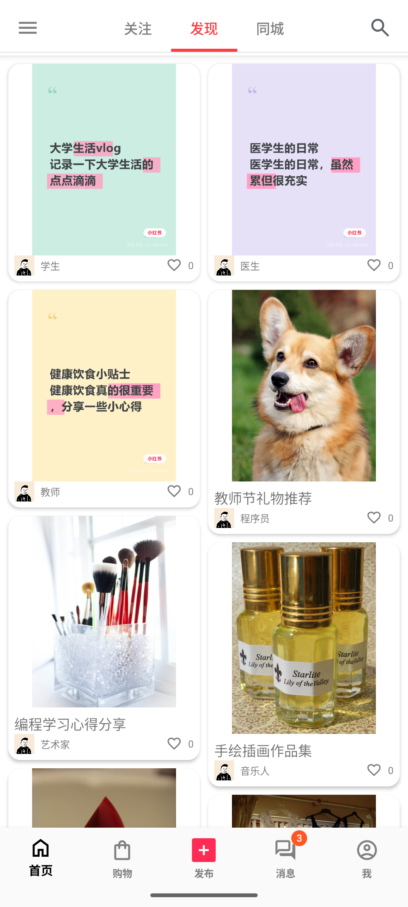
  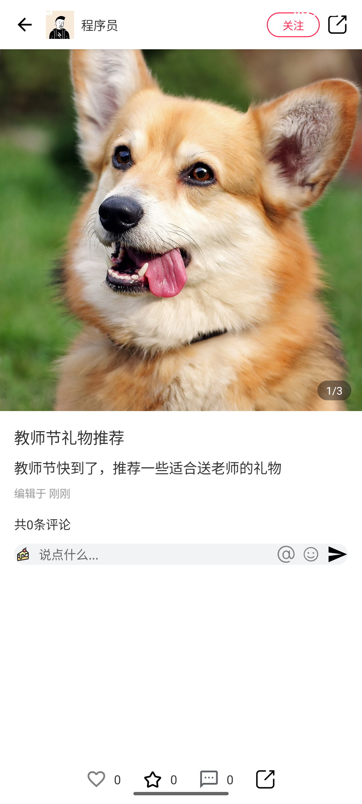
  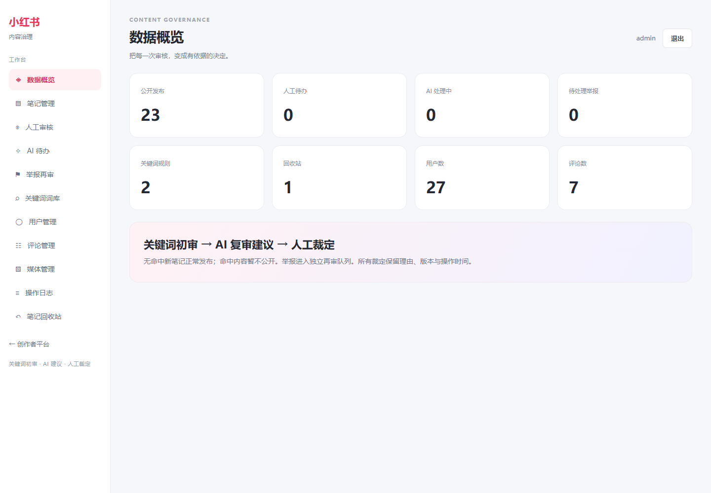
</p>

<p align="center">
  <a href="#项目定位">项目定位</a> ·
  <a href="#核心能力">核心能力</a> ·
  <a href="#快速运行">快速运行</a> ·
  <a href="docs/PROJECT-SHOWCASE.md">项目详解</a>
</p>


## 项目定位

这是一个从移动端交互、离线数据、网络同步到服务端管理后台的完整学习型项目。它以生活方式社区为产品原型，重点展示以下工程能力：

- 使用 Java/Kotlin、Android View、RecyclerView、ViewPager2、Room 和 Retrofit 构建 Android 客户端。
- 使用本地 Room 作为可用性基础，联网后通过 REST API 同步账号、笔记、互动和发布队列。
- 使用 Express、JWT、bcrypt、MySQL/JSON 存储实现配套服务端。
- 同时提供创作者工作台和管理员内容治理后台，形成从创作到审核的闭环。
- 通过关键词初审、AI 复审建议、人工审核、举报再审和审计日志展示内容治理设计。

> 本项目是独立学习与作品展示项目，与小红书官方没有隶属、授权或商业合作关系。仓库中的界面和素材仅用于技术演示。

## 核心能力

| 模块 | 已实现内容 | 展示的工程能力 |
| --- | --- | --- |
| 信息流 | 发现、关注、同城、瀑布流卡片、图文详情、视频详情 | RecyclerView、分页/列表状态、媒体加载、手势交互 |
| 社区互动 | 点赞、收藏、关注、评论、一级回复、@提醒、通知 | Room 关系表、幂等操作、状态同步、交互反馈 |
| 搜索 | 笔记/用户/商品分类、联想、历史、综合/最新/最热排序 | 本地与远程结果合并、去重、关键词聚合 |
| 创作发布 | 图文/纯文字发布、草稿、图片上传、文字海报、话题推荐 | 本地草稿、媒体上传、失败重试、编辑器状态管理 |
| AI 创作助手 | 根据想法和风格生成标题、正文和话题，确认后回填编辑器 | 后端代理 API、密钥隔离、失败提示、可选能力降级 |
| 内容治理 | 关键词初审、AI 建议、人工审核、举报、回收站、审计日志 | 权限边界、审核状态机、批量操作、可追踪性 |
| 创作者平台 | 内容管理、草稿导入、数据中心、近 7 天趋势 | Express Web、CSV 导入、服务端分页、统计聚合 |
| 商城与钱包 | 商品、购物车、订单、模拟充值、薯币账本、送礼扣费 | 事务式余额校验、账本、幂等入账、演示闭环 |
| 离线可用 | 本地 Room 回退、发布/草稿待同步队列、媒体重试 | Local-first 思路、同步边界和失败恢复 |

## 页面与功能截图

### Android 客户端

<p align="center">
  
  
  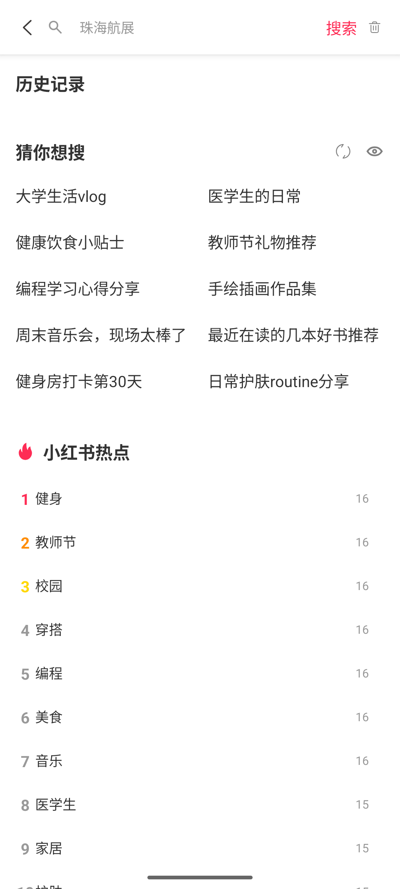
  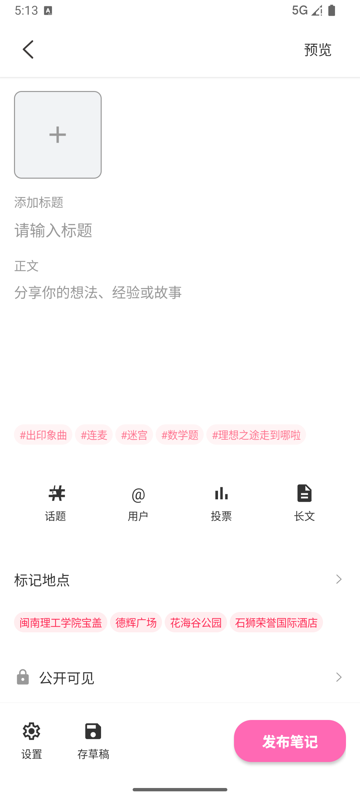
</p>

<p align="center">
  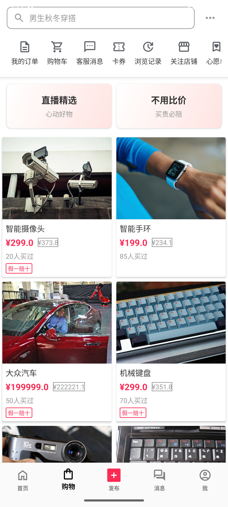
  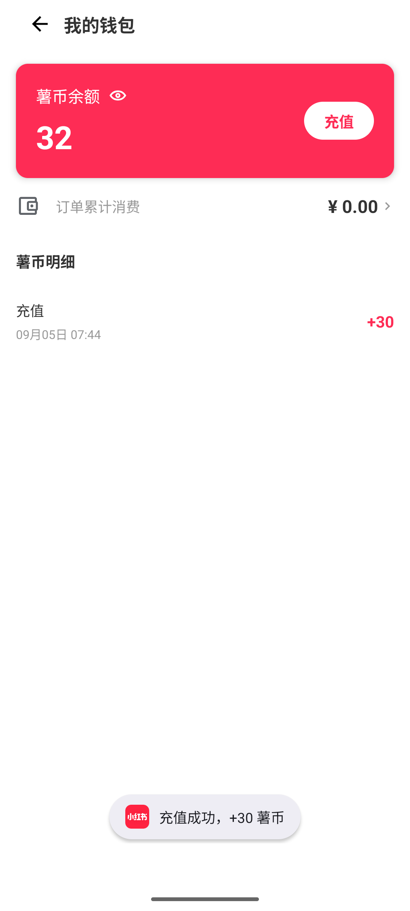
  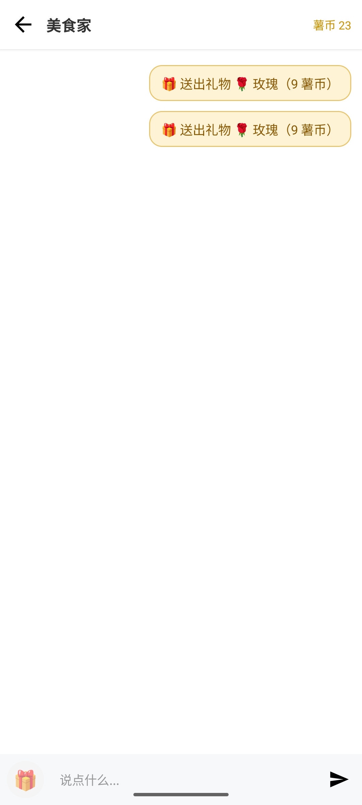
  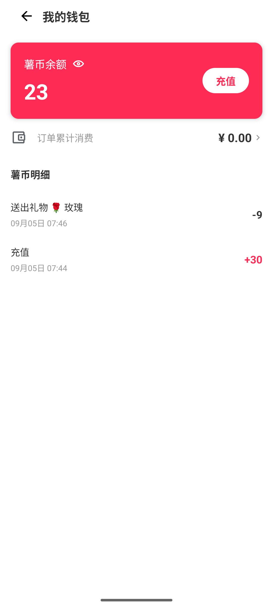
</p>

### 创作者与管理员 Web 工作台

<p align="center">
  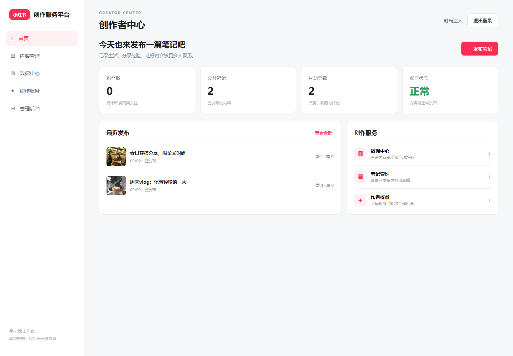
  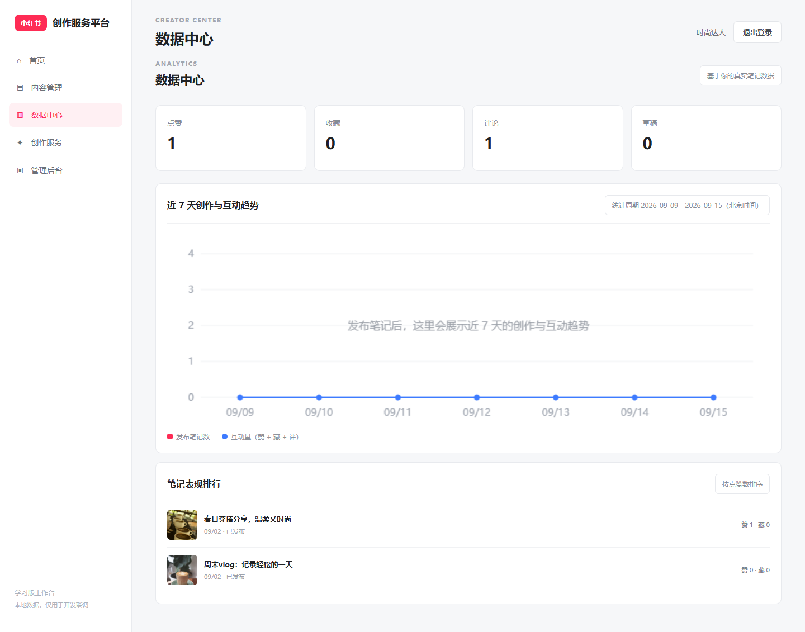
</p>

<p align="center">
  
  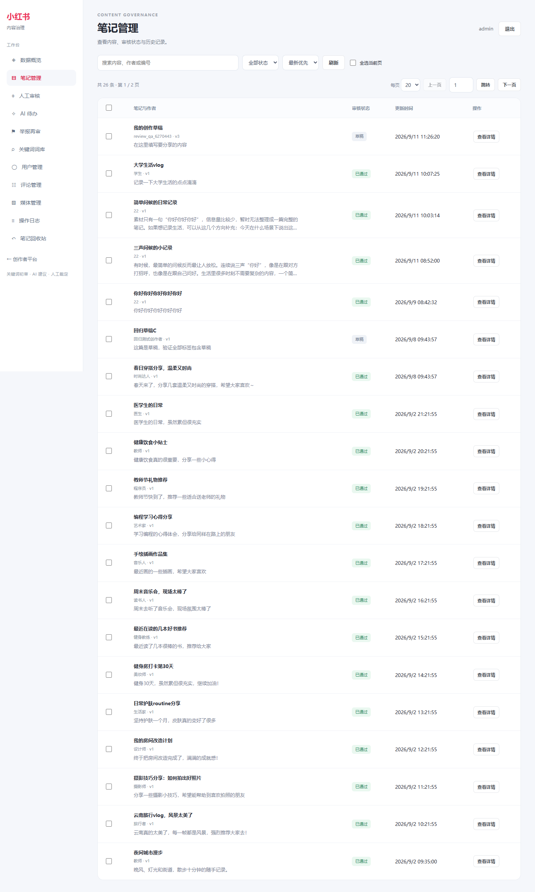
</p>

## 系统架构

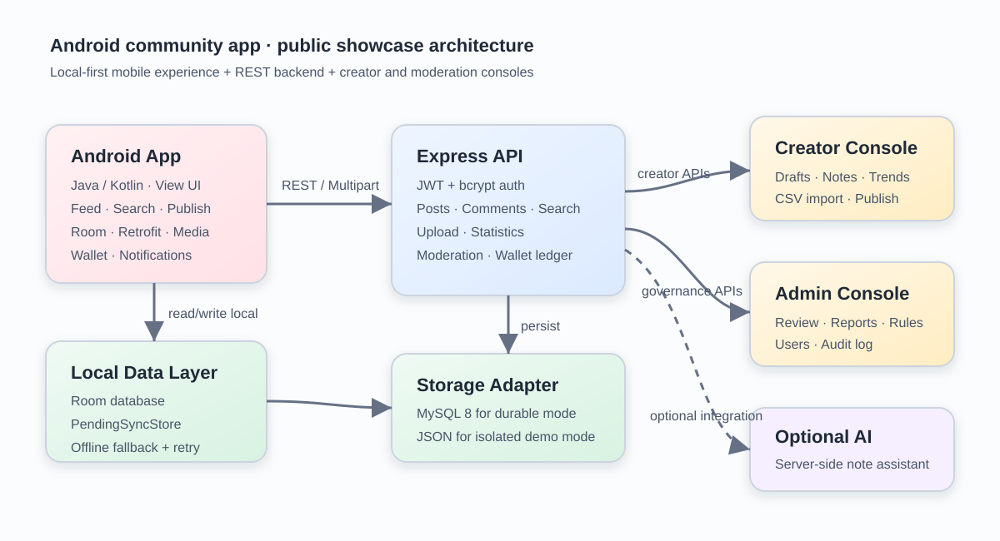

核心数据流如下：

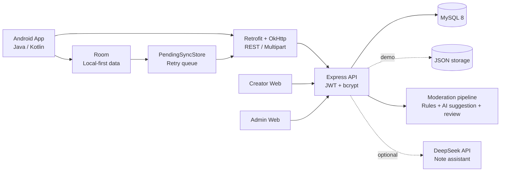

### 目录说明

```text
app/src/main/java/com/xiaohongshu/
├── activity/       # 图文、视频、搜索、商城等页面
├── database/       # Room Database、Entity、DAO、Migration
├── network/        # Retrofit API、远程模型、待同步队列
├── ui/             # 登录、首页、发布、钱包、创作者等业务模块
└── util/           # 图片、二维码、动画和文本海报工具

server/
├── server.js       # Express API 与启动配置
├── storage.js      # MySQL / JSON 存储适配
├── moderation*.js  # 审核规则、审核路由和 AI 复审任务
├── public/         # 创作者平台、管理员后台和演示种子素材
└── *.test.js       # 服务端单元测试与接口 smoke test
```

## 快速运行

### 环境要求

- Android Studio、Android SDK 35、JDK 17。
- Node.js 18 或更高版本。
- Android 模拟器或 Android 7.0（API 24）以上设备。
- MySQL 8.0 仅在需要验证生产式存储时使用；默认演示可以使用隔离 JSON 存储。

### 1. 启动服务端

```powershell
cd server
npm ci
copy .env.example .env
npm run start
```

启动后可以访问：

- API 健康检查：`http://localhost:3001/api/health`
- 创作者工作台：`http://localhost:3001/`
- 管理员后台：`http://localhost:3001/admin`

`.env.example` 默认使用 JSON 演示存储，不需要先安装 MySQL。正式接入 MySQL 时，再配置数据库连接并运行：

```powershell
npm run migrate:mysql
npm run start
```

### 2. 运行 Android 客户端

使用 Android Studio 打开仓库根目录，等待 Gradle 同步后运行 `app` 模块。Android 模拟器默认通过 `10.0.2.2:3001` 访问宿主机；真机调试时，把 `app/src/main/res/values/strings.xml` 中的 `backend_base_url` 改成电脑局域网 IP。

也可以在根目录构建 Debug APK：

```powershell
.\gradlew.bat assembleDebug
```

### 3. 演示账号

服务端启动时会自动初始化演示种子内容，普通演示账号为：

```text
账号：user1
密码：123456
```

管理员账号和密码由 `.env` 控制；不要把真实密码、JWT 密钥或 AI API Key 提交到仓库。AI 笔记助手为可选功能，只有配置 `DEEPSEEK_API_KEY` 后才会启用。

## License

本项目使用 [MIT License](LICENSE)。其中的第三方图标、字体和示例素材以 [resources/credits.json](resources/credits.json) 中的记录为准。
